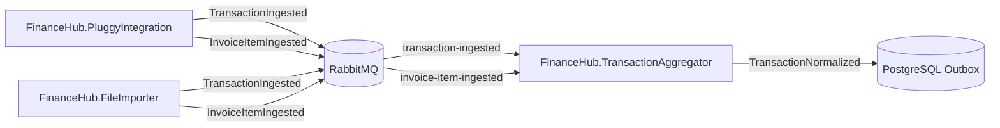

# 🏛️ FinanceHub — Arquitetura de Sistemas, Microsserviços e Topologia de Dados

> **Documento de Referência Arquitetural e Decisão de Engenharia (ADR / Knowledge Base)**  
> **Última Atualização:** 2026-08-16  
> **Status:** Ativo / Consolidado

---

## 🎯 1. Visão Geral & Evolução Arquitetural

O **FinanceHub** é uma plataforma de agregação, controle e inteligência financeira pessoal desenvolvida em **.NET 10** e **C# 13**, estruturada sob **Clean Architecture** e **Domain-Driven Design (DDD)**.

### 🔄 Decisão Arquitetural: Transição de Modelo de Conexão Bancária
* **Modelo Anterior**: Conectores individuais diretos por instituição bancária (`ItauIntegration`, `MercadoPagoIntegration`, `InterIntegration`) baseados em FAPI 1.0/2.0 corporativo. Esse modelo exigia certificados digitais ICP-Brasil PJ de alto custo e burocracia de credenciamento bancário.
* **Modelo Consolidado (Atual)**:
  1. **Conexão Primária Online (On-Demand)**: Centralizada no microsserviço **`FinanceHub.PluggyIntegration`**, conectando diretamente à infraestrutura Open Finance do **Meu.Pluggy** (B2C / Pessoa Física), cobrindo de forma unificada **Itaú**, **Banco Inter** e **Mercado Pago** com 100% de fidelidade de dados.
  2. **Motor de Importação Offline (Fallback)**: Centralizado no microsserviço **`FinanceHub.FileImporter`**, responsável pelo processamento de arquivos físicos históricos (`.ofx`, `.csv`, `.pdf`) quando a sincronização online não for viável.
  3. **Motor Canônico e Contábil**: Centralizado no **`FinanceHub.TransactionAggregator`**, garantindo deduplicação estrita (SHA-256), regras de categorização automática, reconciliação de transferências/faturas e projeções financeiras.

---

## 🏛️ 2. Matriz Consolidada de Microsserviços

```
/
├── src/
│   ├── Services/
│   │   ├── ApiGateway/                  <-- [BFF] Ponto de entrada unificado, auth e roteamento
│   │   ├── PluggyIntegration/          <-- [Online] Conector Open Finance Pessoal (Itaú, Inter, MP)
│   │   ├── FileImporter/               <-- [Offline] Motor de importação de arquivos (OFX, CSV, PDF)
│   │   └── TransactionAggregator/       <-- [Core DDD] Ledger canônico, deduplicação SHA-256 e regras
│   │
│   └── Shared/
│       ├── FinanceHub.Shared.Messaging/     <-- MassTransit / RabbitMQ, Outbox e Contratos de Eventos
│       └── FinanceHub.Shared.Observability/ <-- OpenTelemetry (Tracing/Metrics) e Serilog
└── tests/
    └── FinanceHub.UnitTests/            <-- Testes unitários e de integração com Testcontainers
```

---

## 📦 3. Responsabilidade Detalhada por Microsserviço

### 🌐 3.1 `FinanceHub.ApiGateway` (Porta `5050`)
* **Papel**: Backend For Frontend (BFF) unificado.
* **Responsabilidades**:
  * Autenticação e validação de tokens JWT / Scopes (`openfinance:read`, `openfinance:write`).
  * Rate Limiting centralizado com particionamento por IP e usuário.
  * Roteamento HTTP com resiliência padrão (`AddStandardResilienceHandler`).
  * Agregação de endpoints do Dashboard e transações para o frontend web.

### ⚡ 3.2 `FinanceHub.PluggyIntegration` (Porta `5056`)
* **Papel**: Conector unificado de Open Finance Pessoal via Meu.Pluggy.
* **Responsabilidades**:
  * Orquestração de chamadas à API `https://my-api.pluggy.ai` via `MeuPluggyClient` com resiliência Polly (Retry exponencial + Jitter para 5xx e 429).
  * Tradução de entidades bancárias e enriquecimento de categorias via Camada Anti-Corrupção (`PluggyCategoryMapper`).
  * Publicação assíncrona dos eventos de domínio no barramento RabbitMQ:
    * `TransactionIngested`: Transações de contas correntes / contas pagamento.
    * `InvoiceItemIngested`: Compras e parcelamentos de faturas de cartão de crédito.
  * Tratamento de sessão expirada e erros através de exceções de domínio RFC 7807 (`PluggySessionExpiredDomainException`, `PluggyRateLimitDomainException`, `PluggyApiCommunicationDomainException`).

### 📄 3.3 `FinanceHub.FileImporter` (Porta `5006` - Em Construção)
* **Papel**: Motor de ingestão offline para arquivos de extrato e fatura.
* **Responsabilidades**:
  * Parser de extratos bancários em formato **OFX** (Banco Inter).
  * Parser de extratos bancários em formato **CSV** (Mercado Pago).
  * Parsers de extratos e faturas em formato **PDF** via `PdfPig` (Itaú Extrato/Fatura, Mercado Pago Cartão).
  * Emissão dos mesmos eventos canônicos (`TransactionIngested` / `InvoiceItemIngested`) para o barramento.

### 🧠 3.4 `FinanceHub.TransactionAggregator` (Porta `5002`)
* **Papel**: Núcleo contábil, deduplicação e consolidação de patrimônio.
* **Responsabilidades**:
  * Consumo de eventos via MassTransit com **Transactional Outbox** em PostgreSQL.
  * **Deduplicação por Hash SHA-256 (`TransactionHash.ComputeHash`)**: Impede a inserção de transações repetidas independente da fonte (API ou arquivo).
  * **Pipeline de Categorização Automática**: Regras do Usuário $\rightarrow$ Regras Globais de Estabelecimentos $\rightarrow$ Fallback.
  * **Motor de Reconciliação Financeira**: Neutralização contábil de pagamentos de fatura de cartão e transferências entre contas próprias (Anti-Double Counting).
  * Armazenamento exclusivo no banco PostgreSQL `financehub_transactionaggregator`.

---

## 🔄 4. Topologia de Mensageria e Eventos de Domínio



### Contratos de Eventos (`FinanceHub.Shared.Messaging`):
1. **`TransactionIngested`**:
   * `IngestionId`, `Source`, `AccountId`, `BankTransactionId`, `Amount`, `TransactionDate`, `Description`, `Currency`, `RawPayloadJson`, `OccurredAtUtc`.
2. **`InvoiceItemIngested`**:
   * `IngestionId`, `Source`, `CreditCardAccountId`, `CardLastFourDigits`, `BankTransactionId`, `Amount`, `TransactionDate`, `Description`, `Category`, `CurrentInstallment`, `TotalInstallments`, `InvoiceDueDate`, `Currency`, `RawPayloadJson`, `OccurredAtUtc`.

---

## 🔒 5. Segurança, LGPD e Guardrails Arquiteturais

1. **Isolamento Estrito de Banco de Dados**: Cada serviço acessa exclusivamente seu próprio banco PostgreSQL. Comunicação entre serviços ocorre exclusivamente via HTTP BFF ou Mensageria RabbitMQ.
2. **Zero Segredos em Código**: Tokens e credenciais bancárias são carregados dinamicamente via `.env` / variáveis de ambiente.
3. **Privacidade e LGPD**: Sanitização mandatória de logs (nenhum CPF, número de cartão completo ou dado sensível é logado).
4. **Resiliência e Idempotência**: Todo fluxo de ingestão suporta reexecução on-demand sem gerar incongruências ou duplicidades contábeis.
