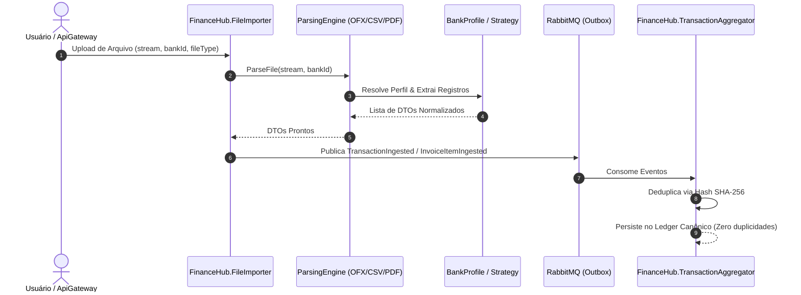

# 📄 PLANO TÉCNICO: FinanceHub.FileImporter (Motor Modular de Importação Offline)

> **STATUS:** 🚀 **APROVADO PARA DESENVOLVIMENTO (ARQUITETURA STRATEGY BASEADA EM PERFIS)**  
> **Data:** 2026-08-16  
> **Objetivo:** Ingestão desacoplada de extratos e faturas em formatos padronizados (OFX, CSV) e formatos gráficos (PDF) utilizando o **Strategy Pattern** para suportar qualquer instituição bancária sem alterar o algoritmo central.  
> **Documento de Referência:** [system-architecture-and-services.md](file:///home/josemd12/Code/FinanceHub/.agents/knowledge/system-architecture-and-services.md)

---

## 🏛️ 1. Arquitetura do Motor de Importação (Strategy Pattern)

Em vez de criar parsers rígidos e engessados por banco, o `FinanceHub.FileImporter` é estruturado em **3 Motores Genéricos (Engines)** orientados a **Perfis de Banco (Bank Strategies)**:

```
                                  ┌────────────────────────────────┐
                                  │   FinanceHub.FileImporter      │
                                  │      (Ingestion Engine)        │
                                  └───────────────┬────────────────┘
                                                  │
                ┌─────────────────────────────────┼─────────────────────────────────┐
                ▼                                 ▼                                 ▼
   ┌───────────────────────────┐     ┌───────────────────────────┐     ┌───────────────────────────┐
   │        OFX Engine         │     │        CSV Engine         │     │        PDF Engine         │
   │  (Parser SGML Standard)   │     │ (CsvHelper + BankProfile) │     │ (PdfPig + LayoutStrategy) │
   └────────────┬──────────────┘     └────────────┬──────────────┘     └────────────┬──────────────┘
                │                                 │                                 │
      ┌─────────┴─────────┐             ┌─────────┴─────────┐             ┌─────────┴─────────┐
      │  IOfxBankProfile  │             │  ICsvBankProfile  │             │  IPdfBankStrategy │
      ├───────────────────┤             ├───────────────────┤             ├───────────────────┤
      │ • Inter OFX       │             │ • Inter CSV (;)   │             │ • Itaú Extrato PDF│
      │ • Itaú OFX        │             │ • MP Extrato (,)  │             │ • Itaú Fatura PDF │
      │ • Standard OFX    │             │ • Itaú CSV (;)    │             │ • MP Fatura PDF   │
      └─────────┬─────────┘             └─────────┬─────────┘             └─────────┬─────────┘
                │                                 │                                 │
                └─────────────────────────────────┼─────────────────────────────────┘
                                                  │
                                                  ▼
                                ┌──────────────────────────────────┐
                                │   Eventos de Domínio no Bus      │
                                │   • TransactionIngested          │
                                │   • InvoiceItemIngested          │
                                └──────────────────────────────────┘
```

---

## 🧩 2. Motores Genéricos e Estratégias por Formato

### 2.1 📘 Motor OFX Genérico (`IOfxParsingEngine`)
* **Conceito**: O formato `.ofx` segue a especificação internacional OFX/SGML. O leitor base interpreta blocos `<STMTTRN>`, `<DTPOSTED>`, `<TRNAMT>`, `<FITID>` e `<MEMO>`.
* **Strategy (`IOfxBankProfile`)**:
  * Fornece apenas metadados específicos da instituição (ex: identificador `"Inter"`, `"Itau"`, timezone bancário).
  * **Qualquer banco que exporte OFX funciona imediatamente** com o perfil padrão (`StandardOfxProfile`).

### 2.2 📗 Motor CSV Genérico (`ICsvParsingEngine` via `CsvHelper`)
* **Conceito**: Um único pipeline de leitura fluida baseado em `CsvHelper`.
* **Strategy (`ICsvBankProfile`)**:
  * Define o **delimitador** (ex: `;` para Inter/Itaú, `,` para Mercado Pago), **encoding** (`UTF-8` vs `ISO-8859-1`), **formato de data** (`dd/MM/yyyy` vs `yyyy-MM-dd`), **formato numérico** (vírgula decimal brasileira `pt-BR`) e o `ClassMap` correspondente.
  * **Adicionar um novo banco** requer apenas criar uma nova classe que implemente `ICsvBankProfile` (ex: `NubankCsvProfile`, `CaixaCsvProfile`) sem tocar no motor de execução.

### 2.3 📕 Motor PDF Especializado (`IPdfParsingEngine` via `PdfPig`)
* **Conceito**: Como PDFs não possuem formato estruturado único (possuem coordenadas visuais, tabelas desenhadas e quebras de linha específicas), o PDF Engine utiliza o **Strategy Pattern** especializado por layout bancário real.
* **Estratégias Concretas Validadas** (baseadas nos arquivos reais de `downloaded/`):
  1. `ItauExtratoPdfStrategy`: Extrai cabeçalho de agência/conta e linhas com regex `^(\d{2}/\d{2}/\d{4})\s+(.+?)\s+(-?\d{1,3}(?:\.\d{3})*,\d{2})$`.
  2. `ItauFaturaPdfStrategy`: Extrai vencimento, limite e compras com formato `DD/MM DESCRIÇÃO R$ VALOR`.
  3. `MercadoPagoFaturaPdfStrategy`: Extrai tabela de parcelas e transações do cartão de crédito Mercado Pago.

---

## 📊 3. Matriz de Compatibilidade dos Arquivos Reais (`downloaded/`)

| Instituição | Tipo de Documento | Formato | Motor Utilizado | Estratégia / Perfil | Evento Canônico Emitido |
| :--- | :--- | :---: | :--- | :--- | :--- |
| **Banco Inter** | Extrato Conta Corrente | `.ofx` | `OfxParsingEngine` | `InterOfxProfile` | `TransactionIngested` |
| **Banco Inter** | Fatura Cartão de Crédito | `.csv` | `CsvParsingEngine` | `InterCreditCardCsvProfile` (Delim: `;`) | `InvoiceItemIngested` |
| **Mercado Pago** | Extrato Conta Pagamento | `.csv` | `CsvParsingEngine` | `MercadoPagoStatementCsvProfile` (Delim: `,`) | `TransactionIngested` |
| **Mercado Pago** | Fatura Cartão de Crédito | `.pdf` | `PdfParsingEngine` | `MercadoPagoInvoicePdfStrategy` | `InvoiceItemIngested` |
| **Banco Itaú** | Extrato Conta Corrente | `.pdf` | `PdfParsingEngine` | `ItauStatementPdfStrategy` | `TransactionIngested` |
| **Banco Itaú** | Fatura Cartão de Crédito | `.pdf` | `PdfParsingEngine` | `ItauInvoicePdfStrategy` | `InvoiceItemIngested` |

---

## 🔄 4. Fluxo de Execução e Deduplicação



---

## 🎯 5. Benefícios da Arquitetura

1. **Desacoplamento Total**: O algoritmo de leitura do CSV ou OFX nunca é alterado ao adicionar novas instituições.
2. **Extensibilidade Imediata**: Suporte a novos bancos (ex: Nubank, C6, BTG, Santander) requer apenas um novo `ICsvBankProfile` ou `IOfxBankProfile`.
3. **Idempotência Garantida**: Como todos os motores produzem os mesmos contratos de eventos (`TransactionIngested` e `InvoiceItemIngested`), o `TransactionAggregator` garante deduplicação total mesmo se o usuário fizer upload do mesmo arquivo repetidas vezes.
