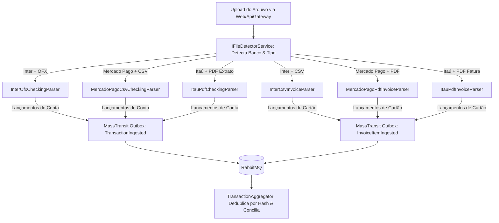

# 📋 Plano Arquitetural: Motor Universal de Importação e Parsing de Extratos e Faturas

Este documento detalha o planejamento técnico e a arquitetura de software para o **Motor de Importação e Parsing de Arquivos Financeiros** no **FinanceHub**, cobrindo a matriz real de formatos identificada para **Banco Inter, Mercado Pago e Banco Itaú** (OFX, CSV e PDF).

---

## 🎯 Matriz Real de Arquivos por Instituição

| Instituição Financeira | Tipo de Documento | Formato Disponível | Estratégia de Leitura / Parsing | Evento Gerado |
| :--- | :--- | :---: | :--- | :--- |
| **Banco Inter** | Extrato Conta Corrente | **OFX** | Parser Estruturado XML/SGML (`<STMTTRN>`) | `TransactionIngested` |
| **Banco Inter** | Fatura Cartão de Crédito | **CSV** | Parser CsvHelper com Mapeamento de Colunas | `InvoiceItemIngested` |
| **Mercado Pago** | Extrato da Conta / Saldo | **CSV** | Parser CsvHelper com Delimitador Dinâmico | `TransactionIngested` |
| **Mercado Pago** | Fatura Cartão de Crédito | **PDF** | Leitor de Texto / Layout PDF (`PdfPig` + Regex) | `InvoiceItemIngested` |
| **Banco Itaú** | Extrato Conta Corrente | **PDF** | Leitor de Linhas de Extrato PDF (`PdfPig` + Regex) | `TransactionIngested` |
| **Banco Itaú** | Fatura Cartão de Crédito | **PDF** | Extrator de Tabela de Lançamentos de Fatura PDF | `InvoiceItemIngested` |

---

## 🏗️ Fluxo de Arquitetura e Padrão Strategy

O importador utiliza o **Strategy Pattern** para desacoplar o algoritmo de parsing de cada arquivo específico:



---

## 🔍 Regras de Parsing e Scrapping por Formato

### 1. Banco Inter: Extrato Conta Corrente (OFX)
*   **Identificador de Banco**: Tags `<ORG>BANCO INTER` ou `<BANKID>077`.
*   **Extração de Campos**:
    *   `Data`: `<DTPOSTED>` (Formato `YYYYMMDDHHMMSS[TZ]`).
    *   `Valor`: `<TRNAMT>` (Decimal assinado: positivo para créditos, negativo para débitos).
    *   `ID Único do Banco`: `<FITID>`.
    *   `Descrição`: `<MEMO>` (Sanitizado contra PII/LGPD).

### 2. Banco Inter: Fatura de Cartão de Crédito (CSV)
*   **Identificador de Cabeçalho**: Presença de colunas como `Data`, `Descrição`, `Categoria`, `Valor`.
*   **Extração de Parcelas**: Extração de metadados como `02/10` da descrição ou coluna dedicada de parcela.

### 3. Mercado Pago: Extrato da Conta (CSV)
*   **Delimitador**: Detecção automática de `,` ou `;`.
*   **Colunas**: `Data de Liberação`, `Descrição`, `Valor Líquido (R$)`, `Identificador`.
*   **Tratamento**: Conversão de valores brasileiros (`1.250,50` $\rightarrow$ `1250.50m`).

### 4. Mercado Pago & Itaú: Fatura de Cartão de Crédito (PDF)
*   **Biblioteca**: `UglyToad.PdfPig` (100% C# nativo, rápida, sem dependências externas).
*   **Algoritmo de Scrapping**:
    1.  Extrai os blocos de texto por página.
    2.  Localiza a seção de **"Lançamentos"** ou **"Detalhamento da Fatura"**.
    3.  Aplica Regex de correspondência de linha:
        ```regex
        (?<date>\d{2}/\d{2})\s+(?<description>.+?)\s+(?:(?<installment>\d{1,2}/\d{1,2})\s+)?(?:R\$\s*)?(?<amount>-?[\d\.,]+)
        ```
    4.  Captura a **Data de Vencimento da Fatura** e o **Mês de Referência** no cabeçalho do PDF para compor a data completa do lançamento (`YYYY-MM-DD`).

### 5. Banco Itaú: Extrato de Conta Corrente (PDF)
*   **Algoritmo de Scrapping**:
    1.  Varre as linhas da tabela de movimentações.
    2.  Identifica o padrão de data completa `DD/MM/AAAA` ou `DD/MM`, descrição da operação e valor com indicador de débito/crédito (`-` ou `D`/`C`).

---

## 🏛️ Estrutura de Diretórios e Scaffolding

```
src/Services/FileImport/
├── FinanceHub.FileImport.Domain/
│   ├── Constants/
│   │   └── FileImportConstants.cs
│   ├── Exceptions/
│   │   ├── UnsupportedFileFormatException.cs
│   │   ├── UnrecognizedFileLayoutException.cs
│   │   └── CorruptedFileStreamException.cs
│   └── ValueObjects/
│       └── ParsedFinancialItem.cs
├── FinanceHub.FileImport.Application/
│   ├── Commands/
│   │   ├── ImportFinancialFile/
│   │   │   ├── ImportFinancialFileCommand.cs
│   │   │   ├── IImportFinancialFileCommandHandler.cs
│   │   │   └── ImportFinancialFileCommandHandler.cs
│   ├── Interfaces/
│   │   ├── IFileDetectorService.cs
│   │   └── IFileParserStrategy.cs
│   └── DTOs/
│       └── ImportFileResultDto.cs
├── FinanceHub.FileImport.Infrastructure/
│   ├── Detection/
│   │   └── FileDetectorService.cs
│   ├── Parsers/
│   │   ├── Inter/
│   │   │   ├── InterOfxCheckingParser.cs
│   │   │   └── InterCsvInvoiceParser.cs
│   │   ├── MercadoPago/
│   │   │   ├── MercadoPagoCsvCheckingParser.cs
│   │   │   └── MercadoPagoPdfInvoiceParser.cs
│   │   └── Itau/
│   │       ├── ItauPdfCheckingParser.cs
│   │       └── ItauPdfInvoiceParser.cs
│   └── Services/
│       └── PdfTextExtractionService.cs
└── FinanceHub.FileImport.Api/
    ├── Endpoints/
    │   └── ImportEndpoints.cs             <-- POST /api/v1/import/upload
    └── Program.cs
```

---

## 🧪 Estratégia de Testes (TDD)

1.  **Testes de Detecção (`FileDetectorServiceTests.cs`)**:
    *   Identifica corretamente tipo de arquivo e banco a partir de streams de amostra.
2.  **Testes de Parsing por Banco e Formato**:
    *   `InterOfxCheckingParserTests.cs`
    *   `InterCsvInvoiceParserTests.cs`
    *   `MercadoPagoCsvCheckingParserTests.cs`
    *   `MercadoPagoPdfInvoiceParserTests.cs`
    *   `ItauPdfCheckingParserTests.cs`
    *   `ItauPdfInvoiceParserTests.cs`
3.  **Testes de Sanitização e Cálculo de Hash**:
    *   Garantia de que transações idênticas recebem o mesmo Hash de deduplicação e que dados de CPF/cartão são mascarados.
