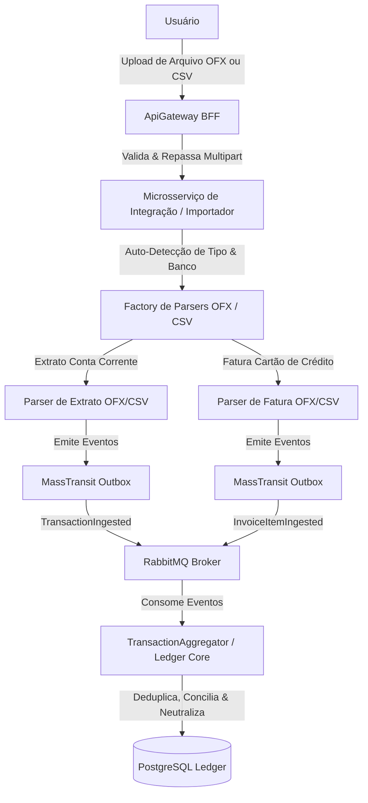

# 📋 Plano de Conexão: Motor de Importação de Extratos e Faturas (OFX / CSV)

Este documento detalha o planejamento técnico da funcionalidade de **Importação Universal de Arquivos de Extrato e Fatura** para o **FinanceHub**, garantindo suporte completo à leitura e processamento de arquivos **OFX** e **CSV** exportados do **Banco Inter, Itaú e Mercado Pago** de forma 100% local, gratuita e segura.

---

## 🎯 Objetivo & Escopo
Permitir que o usuário carregue arquivos de **Extrato de Conta Corrente** (débitos, créditos, Pix, TEDs, rendimentos) e **Faturas de Cartão de Crédito** (compras à vista, parceladas, estornos e encargos) nos formatos **OFX** (Open Financial Exchange) e **CSV** (Comma-Separated Values).

---

## 🏗️ Fluxo de Arquitetura do Importador

O fluxo segue os princípios de desacoplamento por microsserviços e mensageria já estabelecidos no FinanceHub:

---

## 📂 Suporte a Formatos (OFX e CSV) por Instituição e Tipo de Dado

O motor de importação conta com auto-detecção de formato e estrutura de colunas:

| Instituição | Tipo de Documento | Suporte a OFX | Suporte a CSV | Detalhes do Layout / Colunas |
| :--- | :--- | :---: | :---: | :--- |
| **Banco Inter** | Extrato Conta Corrente | ✅ Sim | ✅ Sim | OFX padrão (`<BANKTRANLIST>`) ou CSV com `Data`, `Histórico`, `Valor`. |
| **Banco Inter** | Fatura Cartão de Crédito | ✅ Sim (`CCSTMTTRNRS`) | ✅ Sim | CSV de fatura com `Data`, `Descrição`, `Valor`, `Parcela`. |
| **Banco Itaú** | Extrato Conta Corrente | ✅ Sim | ✅ Sim | OFX padrão Itaú ou CSV com `Data`, `Lançamento`, `Valor (R$)`, `Saldo`. |
| **Banco Itaú** | Fatura Cartão de Crédito | ✅ Sim | ✅ Sim | OFX de cartão ou CSV com `Data`, `Estabelecimento`, `Valor`, `Parcela`. |
| **Mercado Pago** | Extrato da Conta | ✅ Sim | ✅ Sim | CSV detalhado com `Data de Liberação`, `Descrição`, `Valor Líquido`. |
| **Mercado Pago** | Fatura Cartão Mercado Pago | ✅ Sim | ✅ Sim | CSV/OFX de lançamentos de fatura de crédito. |

---

## 🧠 Auto-Detecção Inteligente do Arquivo

O importador não exige que o usuário selecione manualmente o banco ou o tipo de arquivo:
1. **Detecção do Tipo de Arquivo**:
   * Arquivo iniciando com tags XML/SGML (`<OFX>`, `<BANKMSGSRSV1>`, `<CCSTMTTRNRS>`) $\rightarrow$ Direcionado para o **Parser OFX**.
   * Arquivo de texto delimitado por vírgula (`,`), ponto-e-vírgula (`;`) ou tabulação (`\t`) $\rightarrow$ Direcionado para o **Parser CSV**.
2. **Detecção do Banco Emissor**:
   * No **OFX**: Leitura das tags `<ORG>` e `<FID>` (ex: `<ORG>BANCO INTER`, `<ORG>ITAU`).
   * No **CSV**: Inspeção dos cabeçalhos das primeiras 3 linhas para bater com o layout conhecido de cada instituição.
3. **Detecção da Natureza do Lançamento**:
   * Se contiver tags de cartão de crédito (`<CCSTMTTRNRS>`) ou colunas de `Parcela` / `Número do Cartão` $\rightarrow$ Processado como **Fatura de Cartão de Crédito** (`InvoiceItemIngested`).
   * Se for extrato bancário padrão $\rightarrow$ Processado como **Extrato de Conta Corrente** (`TransactionIngested`).

---

## 🏛️ Estrutura de Implementação Proposta

### 1. Camada de Domínio (`Domain`)
* `FileImportConstants.cs`: Definição de formatos aceitos (`.ofx`, `.csv`), tamanho máximo de upload (ex: 10MB) e assinaturas de cabeçalho.
* **Exceptions**: `UnsupportedFileExtensionException`, `UnrecognizedFileLayoutException`, `CorruptedFileException`.

### 2. Camada de Aplicação (`Application`)
* `ImportFinancialFileCommand.cs` & `IImportFinancialFileCommandHandler.cs` & `ImportFinancialFileCommandHandler.cs`:
  * Recebe o stream do arquivo multipart enviado via API Gateway.
  * Executa a auto-detecção e invoca o parser correspondente.
  * Mapeia os lançamentos com sanitização LGPD (PII) e calcula o Hash Único de cada item.
  * Publica os eventos no RabbitMQ com garantia do Transactional Outbox Pattern.

### 3. Camada de Infraestrutura (`Infrastructure`)
* `OfxFileParser.cs`: Leitor robusto para extratos bancários e faturas de cartão em formato OFX.
* `CsvFileParser.cs`: Leitor com suporte dinâmico a separadores `,` e `;` e diferentes encodings (`UTF-8`, `ISO-8859-1`).

---

## 🧪 Estratégia de Testes (TDD Red-Green-Refactor)

1. **Testes de Parsing OFX (`OfxFileParserTests.cs`)**:
   * Extrato de conta corrente (Inter / Itaú) com créditos (+) e débitos (-).
   * Fatura de cartão de crédito (`CCSTMTTRNRS`) com compras e estornos.
2. **Testes de Parsing CSV (`CsvFileParserTests.cs`)**:
   * CSV com vírgula e ponto-e-vírgula como separador.
   * CSV de extrato de conta do Mercado Pago e do Banco Inter.
   * CSV de fatura de cartão de crédito com identificação de parcelas (ex: `02/10`).
3. **Testes de Idempotência e Hash Único**:
   * Importar o mesmo arquivo duas vezes seguidas não gera registros duplicados no banco de dados.
