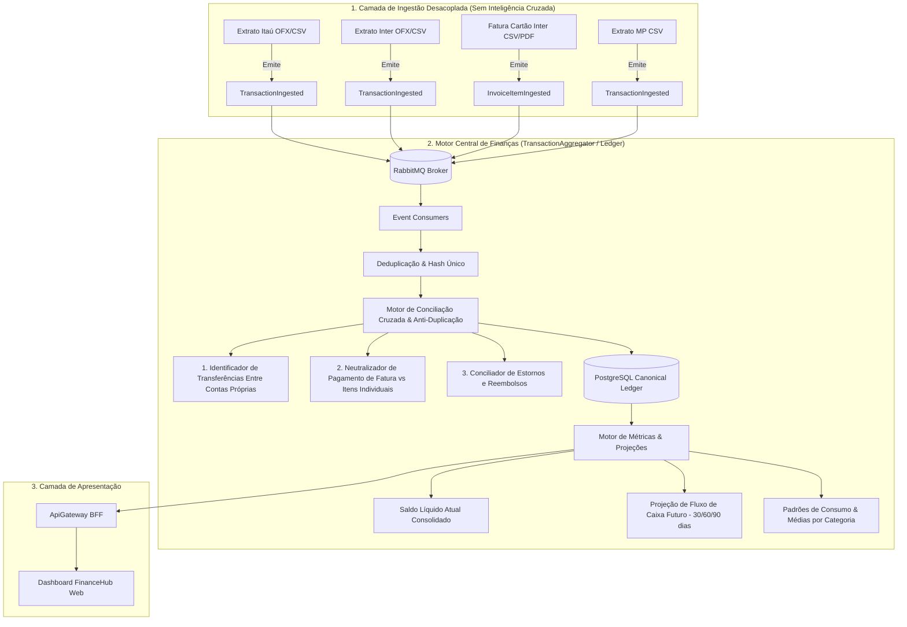

# 🧠 Plano Arquitetural: Motor de Conciliação, Faturas de Cartão, Projeções e Métricas Financeiras

Este documento responde às perguntas de arquitetura de software e detalha a especificação técnica para a **consolidação de extratos (débito/pix/receitas)** e **faturas de cartão de crédito**, eliminação de duplicidades (double-counting), projeções de saldo futuro e inteligência de gastos.

---

## 🏛️ 1. Onde Deve Ficar Esta Responsabilidade? (Decisão Arquitetural)

### ❌ Por que NÃO deve ficar nos Microsserviços de Integração Bancária?
Os microsserviços de integração (Itaú, Inter, Mercado Pago, Importador OFX/CSV) têm **responsabilidade única de transporte e parsing** (Single Responsibility Principle):
* Eles apenas leem o arquivo ou payload bruto, mascaram dados sensíveis (LGPD) e emitem eventos canônicos (`TransactionIngested`, `InvoiceIngested`).
* Eles **não conhecem outros bancos**. O conector do Itaú não sabe que você tem conta no Inter, portanto é incapaz de detectar que um Pix saindo do Itaú entrou no Inter ou pagou uma fatura do Inter.

### ✅ A Solução: Microsserviço Especializado de Inteligência e Conciliação (`FinanceHub.TransactionAggregator` / `LedgerEngine`)
Toda a lógica especializada de conciliação financeira, projeções, consolidação de faturas e hábitos de compra deve residir de forma desacoplada no **`TransactionAggregator`** (evoluído para o motor de Ledger & Insights).



---

## 🔍 2. Regras de Negócio do Motor de Conciliação (Anti-Double-Counting)

O grande desafio de agregadores financeiros pessoais é evitar que o usuário veja gastos inflados ou saldos errados. O motor implementará 3 algoritmos essenciais de conciliação:

### 🔄 Regra 1: Neutralização de Transferências entre Contas Próprias (Self-Transfers)
* **Cenário**: Você transfere R$ 500,00 via Pix do Itaú para o Mercado Pago.
* **Problema**: O extrato do Itaú acusa `-R$ 500,00` (Despesa) e o Mercado Pago acusa `+R$ 500,00` (Receita). Se somados cegamente, seu volume mensal de receitas e despesas fica distorcido em R$ 500,00.
* **Solução Algorítmica**:
  1. O motor cruza transações com mesma data ($\pm 24\text{h}$), mesmo valor absoluto ($|V_1| = |V_2|$), sinais opostos ($V_1 = -V_2$) e mesmo CPF/titularidade.
  2. Ambas as transações recebem a tag canônica `Category = "Transferência Interna"` e `IsNeutralized = true` (não contam como despesa nem como receita nos relatórios de gastos).

---

### 💳 Regra 2: Desduplicação de Pagamento de Fatura vs. Compras no Cartão (Invoice Settlement vs Line-Items)
* **Cenário**: Você fez 10 compras no cartão de crédito do Banco Inter totalizando R$ 2.000,00 ao longo do mês. No dia 10, você paga a fatura de R$ 2.000,00 usando o saldo da sua conta Itaú.
* **Problema**: Se o sistema somar os R$ 2.000,00 das 10 compras individuais + o débito de R$ 2.000,00 do pagamento da fatura no extrato do Itaú, seu gasto parecerá ser de **R$ 4.000,00** (Dupla Contagem / Double-Counting).
* **Solução Algorítmica**:
  1. As compras individuais no cartão de crédito são registradas como despesas reais nas suas respectivas categorias (Alimentação, Lazer, etc.) na data da compra.
  2. O lançamento no extrato bancário identificado como `"PAGAMENTO DE FATURA"`, `"PAGTO CARTAO"` ou débito automático com valor correspondente à fatura é classificado como `Category = "Pagamento de Fatura"` com `IsNeutralized = true`.
  3. **Impacto no Saldo**: O pagamento da fatura afeta o **saldo da conta corrente** (saída de caixa), mas **não entra na soma de despesas por categoria**, pois as despesas já foram computadas nos lançamentos da fatura.

---

### ↩️ Regra 3: Reconciliação de Estornos e Reembolsos (Refunds)
* **Cenário**: Compra de R$ 150,00 em 05/08, seguida de cancelamento/estorno de R$ 150,00 em 08/08.
* **Solução Algorítmica**:
  1. O motor localiza a transação original por correspondência de estabelecimento/descrição e valor.
  2. O reembolso é vinculado à transação original (`ReversedTransactionId`), abatendo diretamente o acumulado daquela categoria no mês em vez de ser classificado como "Nova Renda/Salário".

---

## 📈 3. Motor de Saldo Atual, Projeções e Hábitos de Compra

### 💰 A. Saldo Atual Líquido Consolidado
$$\text{Saldo Total} = \sum_{c \in \text{Contas}} \text{SaldoConta}(c)$$
* **Saldo Líquido Disponível**: Soma dos saldos atuais de todas as contas correntes cadastradas.
* **Saldo Comprometido (Faturas Abertas)**: Total das compras já realizadas no cartão de crédito cuja fatura ainda não fechou/venceu.
* **Patrimônio Líquido Instantâneo**: $\text{Saldo Total} - \text{Faturas Abertas}$.

---

### 🔮 B. Projeção de Saldo Futuro (Cashflow Forecasting 30 / 60 / 90 dias)
O motor calcula o saldo futuro projetado dia a dia:

$$\text{SaldoProjetado}(t) = \text{SaldoAtual} + \sum \text{ReceitasRecorrentes}(t) - \sum \text{FaturasVencendo}(t) - \sum \text{ParcelasFuturas}(t) - \sum \text{DespesasFixas}(t)$$

1. **Parcelas de Cartão Futuras**: Compras parceladas (ex: 3x de R$ 100,00) já alocam despesas automáticas nos meses $M+1, M+2$.
2. **Faturas Fechadas a Pagar**: Descontos programados na data de vencimento da fatura.
3. **Média de Consumo Diário**: Projeção de gastos essenciais baseada no histórico recente.

---

### 📊 C. Padrões de Compra & Insights Inteligentes
* **Média de Gasto Mensal Total (Run-Rate)**: Comparação do ritmo de gastos do mês atual contra os últimos 3 e 6 meses.
* **Distribuição por Categoria**: Percentual de alocação por categoria de gastos (Moradia, Alimentação, Transporte, Lazer, etc.).
* **Detecção de Anomalias**: Alertas de gastos atípicos (ex: despesa 50% acima da média da categoria).

---

## 📂 4. Estrutura de Arquivos e Scaffolding CQRS Proposta

A implementação será concentrada no microsserviço **`FinanceHub.TransactionAggregator`**:

```
src/Services/TransactionAggregator/
├── FinanceHub.TransactionAggregator.Domain/
│   ├── Entities/
│   │   ├── CanonicalTransaction.cs        <-- Aggregate Root com flags de neutralização
│   │   ├── CreditCardInvoice.cs          <-- Agregado de faturas e parcelamentos
│   │   ├── InvoiceLineItem.cs            <-- Itens detalhados da fatura
│   │   └── FinancialAccount.cs           <-- Saldo por conta/banco
│   ├── ValueObjects/
│   │   ├── TransactionCategory.cs        <-- Categorias com regras de neutralização
│   │   └── ReconciliationMatch.cs        <-- Par de transações neutralizadas
│   └── Services/
│       ├── ReconciliationEngine.cs       <-- Algoritmos de Anti-Double-Counting
│       └── CashflowForecaster.cs         <-- Algoritmo de projeção de saldo futuro
├── FinanceHub.TransactionAggregator.Application/
│   ├── Commands/
│   │   ├── IngestTransaction/             <-- Ingestão de extrato
│   │   ├── IngestCreditCardInvoice/       <-- Ingestão de fatura de cartão
│   │   └── ReconcileLedger/               <-- Trigger de conciliação cruzada
│   ├── Queries/
│   │   ├── GetConsolidatedBalance/        <-- Saldo líquido + faturas abertas
│   │   ├── GetCashflowForecast/           <-- Projeção futura dia a dia
│   │   ├── GetSpendingInsights/           <-- Médias, padrões e categorias
│   │   └── GetFilteredTransactions/       <-- Extrato unificado consolidado
│   └── Consumers/
│       ├── TransactionIngestedConsumer.cs <-- Consome extratos
│       └── InvoiceIngestedConsumer.cs     <-- Consome faturas de cartão
└── FinanceHub.TransactionAggregator.Infrastructure/
    ├── Persistence/
    │   ├── AggregatorDbContext.cs         <-- EF Core com tabelas de faturas e extrato
    │   └── Repositories/                  <-- Repositórios especializados
    └── DependencyInjection.cs
```

---

## 🧪 5. Plano de Verificação e Testes (TDD)

1. **Testes Unitários de Conciliação (`ReconciliationEngineTests.cs`)**:
   * Teste: Transferência entre Itaú e Inter não duplica receitas/despesas.
   * Teste: Pagamento de fatura de cartão de crédito não duplica os itens individuais da fatura.
   * Teste: Reembolso neutraliza a despesa correspondente na categoria correta.
2. **Testes Unitários de Projeção (`CashflowForecasterTests.cs`)**:
   * Teste: Parcelamento de 3x distribui corretamente os débitos nos próximos 3 meses.
   * Teste: Saldo futuro desconta o valor da fatura aberta no dia do vencimento.
3. **Testes de Integração com Banco de Dados e Eventos**:
   * Ingestão de um extrato OFX + uma fatura CSV resulta em saldo e transações perfeitamente consolidados sem duplicidades.
