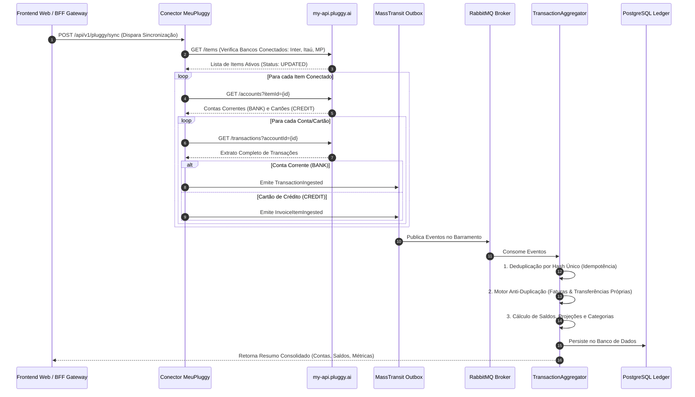

# 📋 Plano de Implementação: Conector Unificado Meu.Pluggy & Motor de Conciliação

Este documento detalha o planejamento técnico completo da integração do **FinanceHub** com a API pessoal do **`meu.pluggy.ai`**, viabilizando a sincronização automatizada, em tempo real e de custo zero de todas as contas correntes e cartões de crédito do **Banco Inter, Itaú e Mercado Pago**.

---

## 🎯 1. Objetivo & Visão Geral da Solução

Conectar o ecossistema FinanceHub à API pessoal (`https://my-api.pluggy.ai`) utilizando o Token de Sessão de Usuário (`PLUGGY_USER_TOKEN`). Esta solução extrai **100% dos dados bancários reais** sem incorrer em custos de planos B2B de desenvolvedores, alimentando o **`TransactionAggregator`** para conciliação cruzada, projeções de saldo e métricas financeiras.

---

## 🏗️ 2. Arquitetura do Fluxo de Dados



---

## 🛡️ 3. Configuração de Ambiente (`.env`)

As seguintes variáveis serão carregadas de forma segura e injetadas nos contêineres:

```env
# Token de Sessão Pessoal do meu.pluggy.ai (24h de validade por token)
PLUGGY_USER_TOKEN=seu_access_token_jwt_aqui

# URL Base da API Pessoal
PLUGGY_USER_API_BASE_URL=https://my-api.pluggy.ai
```

---

## 🏛️ 4. Estrutura de Scaffolding CQRS (Clean Architecture + DDD)

A implementação seguirá as regras modulares do FinanceHub:

### A. Camada de Integração (`FinanceHub.PluggyIntegration` ou unificada)
*   **Domain**:
    *   `PluggyConstants.cs`: URLs oficiais, headers e identificadores.
    *   `Domain Exceptions`: `PluggySessionExpiredDomainException` (RFC 7807 HTTP 401), `PluggyApiCommunicationDomainException` (HTTP 502).
*   **Application**:
    *   `SyncAllPluggyAccountsCommand.cs` & `ISyncAllPluggyAccountsCommandHandler.cs` & `SyncAllPluggyAccountsCommandHandler.cs`: Use-case vertical que orquestra a varredura de items, contas e transações.
    *   `DTOs`: `PluggyAccountDto.cs`, `PluggyTransactionDto.cs`, `SyncSummaryDto.cs`.
    *   `Interfaces`: `IMeuPluggyClient.cs` (Contrato desacoplado para chamadas HTTP).
*   **Infrastructure**:
    *   `MeuPluggyClient.cs`: Cliente HttpClient resiliente com Polly (retry com backoff exponencial).
    *   `PluggyMappingProfile.cs`: Mapeamento de DTOs com mascaramento LGPD (PII) de números de conta e cartão.
*   **Api**:
    *   `SyncEndpoints.cs`: Exposição de `POST /api/v1/pluggy/sync`.

### B. Camada Central de Finanças (`FinanceHub.TransactionAggregator`)
*   **Consumers**:
    *   `TransactionIngestedConsumer.cs`: Ingestão de extratos de conta corrente.
    *   `InvoiceItemIngestedConsumer.cs`: Ingestão de lançamentos de fatura de cartão.
*   **Motor de Conciliação e Anti-Duplicação**:
    *   `ReconciliationEngine.cs`:
        1.  **Neutralização de Pagamentos de Fatura**: Lançamentos de pagamento de fatura no extrato recebem `IsNeutralized = true` para não duplicar com os lançamentos individuais de cartão.
        2.  **Neutralização de Transferências Internas**: Pix/TEDs com mesmo valor e mesma data entre contas do mesmo usuário (ex: Itaú $\leftrightarrow$ Inter $\leftrightarrow$ MP) recebem `Category = "Transferência Interna"` e `IsNeutralized = true`.
        3.  **Abatimento de Estornos**: Reembolsos abatem diretamente a categoria correspondente.
*   **Motor de Projeção & Métricas**:
    *   `GetConsolidatedBalanceQueryHandler.cs`: Retorna Saldo Líquido, Faturas Abertas e Patrimônio Líquido Instantâneo.
    *   `GetCashflowForecastQueryHandler.cs`: Projeção de fluxo de caixa futuro para 30, 60 e 90 dias.

---

## 🚨 5. Tratamento de Erros e Expiração do Token (RFC 7807)

Quando o token de 24h expirar, o sistema responde com um JSON `ProblemDetails` padronizado e amigável:

```json
{
  "type": "https://tools.ietf.org/html/rfc7235#section-3.1",
  "title": "Sessão do Meu.Pluggy Expirada",
  "status": 401,
  "detail": "O token de sessão do meu.pluggy expirou. Atualize a variável PLUGGY_USER_TOKEN no .env ou nas configurações para sincronizar os dados mais recentes.",
  "instance": "/api/v1/gateway/pluggy/sync",
  "errorCode": "PLUGGY_SESSION_EXPIRED",
  "traceId": "00-4bf92f3577b34da6a3ce929d0e0e4736-00f067aa0ba902b7-01"
}
```

*Importante*: Todas as mais de 1.400 transações já ingeridas permanecem salvas e disponíveis para consulta no banco de dados local, mesmo quando o token expirar.

---

## 🧪 6. Plano de Testes Automatizados (TDD Red-Green-Refactor)

1.  **Testes de Cliente HTTP (`MeuPluggyClientTests.cs`)**:
    *   Validação de serialização e tratamento de headers com `FakeHttpHandler`.
    *   Teste de disparo de `PluggySessionExpiredDomainException` quando a API retornar HTTP 401/403.
2.  **Testes do Handler de Sincronização (`SyncAllPluggyAccountsCommandHandlerTests.cs`)**:
    *   Garantia de que contas `BANK` emitem `TransactionIngested` e contas `CREDIT` emitem `InvoiceItemIngested`.
    *   Validação da publicação correta através do `IPublishEndpoint` do MassTransit.
3.  **Testes de Conciliação (`ReconciliationEngineTests.cs`)**:
    *   Garantia matemática de que compras no cartão + pagamento de fatura no extrato não duplicam o total de gastos.
    *   Garantia de neutralização de Pix entre Inter e Itaú.
4.  **Cobertura**: Mínimo de 80% de cobertura com xUnit e FluentAssertions.
