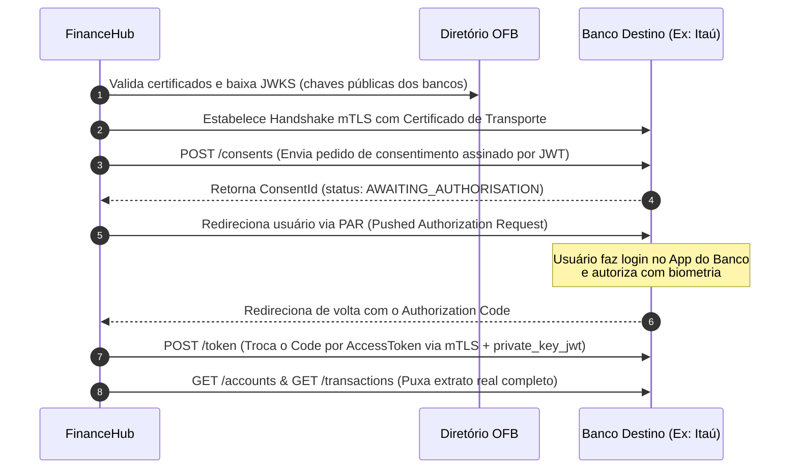

# 🏛️ Planejamento: Como Acessar o Open Finance Brasil Real (Sem Intermediários)

Este guia detalha o passo a passo regulatório, burocrático e técnico necessário para uma aplicação se conectar diretamente à infraestrutura oficial do **Open Finance Brasil** homologada pelo Banco Central (BACEN), permitindo efetuar consultas de dados reais sem depender de provedores terceiros (como Pluggy ou Belvo).

---

## 🔍 Como Funciona o Ecossistema do Open Finance Brasil
O Open Finance Brasil é um ecossistema fechado e altamente regulado. Os bancos não abrem APIs de Open Finance para a internet pública. Eles apenas aceitam conexões de **Instituições Participantes Autorizadas** registradas no Diretório de Participantes centralizado.

---

## 📋 1. Requisitos Regulatórios e Jurídicos (BACEN)

Para obter acesso direto às chaves do diretório de produção, é necessário passar pelo processo de homologação do Banco Central:

1.  **Constituição de uma Instituição Autorizada**:
    *   Sua empresa deve ser homologada pelo BACEN como uma **Instituição de Pagamento (IP)**, **Sociedade de Crédito (SCD)** ou banco.
    *   A licença mais acessível para agregação de dados e iniciação de pagamentos é a de **ITP (Iniciador de Transação de Pagamento)**.
2.  **Adesão à Convenção de Governança**:
    *   Assinar o termo de adesão ao Open Finance Brasil junto à Estrutura de Governança.
3.  **Auditorias de Segurança**:
    *   Comprovar conformidade com as circulares do Banco Central sobre segurança cibernética (políticas de controle de acesso, criptografia, infraestrutura de chaves).

---

## 🔑 2. Requisitos de Infraestrutura e Certificados Digitais

Toda a segurança do Open Finance Brasil é baseada em certificados de **Chave Pública (ICP-Brasil)** de padrão corporativo.

1.  **Compra de Certificados ICP-Brasil OFB**:
    *   Emitidos apenas por autoridades certificadoras autorizadas (ex: Serpro, Soluti, Certisign).
    *   **Certificado de Transporte (mTLS)**: Para autenticação e criptografia do canal SSL com as APIs dos bancos.
    *   **Certificado de Assinatura (Signing)**: Para assinar digitalmente os payloads JSON (JWT) de requisições de consentimento e pagamentos.
2.  **Registro no Diretório de Participantes**:
    *   Configurar sua instituição e fazer o upload das chaves públicas dos seus certificados de produção no Diretório de Participantes do Open Finance.

---

## 🛠️ 3. O Fluxo de Conexão Técnica Direta (FAPI 1.0 Advanced)

Após estar registrado no Diretório, a comunicação com qualquer banco (Itaú, Bradesco, Nubank) segue as regras estritas da especificação **FAPI (Financial-Grade API)**:

### Detalhes Técnicos dos Passos:
1.  **Criação do Consentimento (`POST /consents`)**:
    *   Você envia um JWT assinado com o seu certificado contendo as permissões de leitura (contas, transações, limites) e o período de validade (máximo 365 dias).
2.  **Pushed Authorization Request (PAR)**:
    *   Para evitar passar parâmetros de autorização na URL do navegador do usuário, as informações são enviadas diretamente de servidor para servidor via POST. O banco retorna um link seguro para o qual você redireciona o usuário para fazer a autenticação.
3.  **Consulta do Extrato Real**:
    *   Com o token de acesso gerado, você chama os endpoints oficiais de transações do banco destino:
      `GET https://api.banco.com.br/open-banking/resources/v2/accounts/{accountId}/transactions`

---

## 🎯 Alternativa Prática para Desenvolvedores Independentes

Tendo em vista o alto custo regulatório e de auditorias para obter uma licença própria do Banco Central (que pode passar de centenas de milhares de reais), desenvolvedores de software utilizam o conceito de **BaaS (Banking as a Service) / Open Finance as a Service**:
*   Você utiliza APIs de empresas reguladas (como a Pluggy ou Belvo) que atuam como as detentoras das licenças do BACEN e compartilham a conexão técnica com você de forma simplificada por uma taxa de uso.
