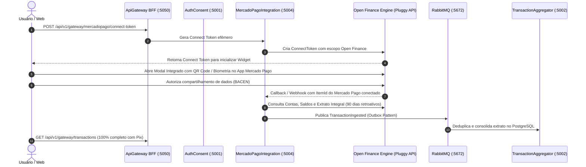

# 🏦 Especificação Técnica: Conexão Mercado Pago via Open Finance Brasil (Provedor Agregador Regulado)

## 📌 Status
**Estado**: `Aprovado para Implementação / Plan Mode Concluído`  
**Instituição Bancária**: Mercado Pago Instituição de Pagamento LTDA  
**Tipo de Integração**: Open Finance Brasil via Provedor de Agregação Regulado (Pluggy Open Finance API)  
**Microsserviço**: `FinanceHub.MercadoPagoIntegration`  
**Consumidor Canônico**: `FinanceHub.TransactionAggregator`  

---

## 🎯 1. Visão Geral e Objetivos de Negócio

Substituição do extrato parcial da API de Desenvolvedores por uma conexão **100% completa via Open Finance Brasil**.

### 1.1 Cobertura de Dados Financeiros:
- **100% de Movimentações de Extrato**:
  - Pix pessoa-a-pessoa (P2P) enviados e recebidos.
  - Transferências bancárias (TED, DOC, transferências de saldo).
  - Pagamentos de boletos, contas e tributos.
  - Compras no débito, crédito e Mercado Livre.
  - Rendimentos de conta remunerada e cashbacks.
- **Saldos em Tempo Real**:
  - Saldo disponível, saldo bloqueado e limites.
- **Identificação e Contas**:
  - Agência, conta corrente/pagamento, chave Pix cadastrada.

---

## 🏛️ 2. Arquitetura da Solução



---

## 🔐 3. Autenticação e Credenciais

### 3.1 Variáveis de Ambiente Necessárias (`.env`):
```env
OPENFINANCE_CLIENT_ID=seu_client_id_aqui
OPENFINANCE_CLIENT_SECRET=seu_client_secret_aqui
```
*(Chaves obtidas gratuitamente no painel de desenvolvedor, sem custo e sem necessidade de CNPJ).*

---

## 🕒 4. Janela Temporal e Estratégia de Sincronização

| Tipo de Execução | Janela de Consulta | Descrição |
| :--- | :--- | :--- |
| **Sincronização Inicial** | `90 dias retroativos` | Busca integral de todo o histórico dos últimos 3 meses (Pix, compras, transferências). |
| **Sincronização Incremental (Sob Demanda)** | `[LastSyncCursorUtc, UtcNow]` | Busca apenas as novas movimentações a partir da data da última sincronização bem-sucedida gravada em `MercadoPagoSyncState`. |
| **Recuperação de Falhas** | `LastSyncCursorUtc - 24 horas` | Janela de segurança de 24h de sobreposição para garantir que transações em liquidação pendente sejam capturadas. |

---

## 🔄 5. Contratos de Dados e Mapeamento

### 5.1 Mapeamento para o Modelo Canônico `TransactionIngested`:
- `TransactionId`: ID único do lançamento Open Finance (ex: `cly123456789`).
- `UserId`: ID do usuário autenticado no FinanceHub.
- `AccountId`: ID da conta bancária no Mercado Pago.
- `BankIdentifier`: `"mercadopago"`.
- `Amount`: Valor com convenção de sinal (positivo para créditos/Pix recebidos, negativo para débitos/Pix enviados).
- `Currency`: `"BRL"`.
- `BookingDateTime`: Data/hora oficial da liquidação no Banco Central.
- `TransactionInformation`: Descrição completa do lançamento (ex: "Pix Enviado - Fulano de Tal", "Pagamento de Boleto").
- `CreditDebitIndicator`: `"CRDT"` para entradas, `"DBIT"` para saídas.
- `RawPayload`: JSON sanitizado com regex LGPD (mascarando CPF/CNPJ/e-mails).

---

## 🛡️ 6. Tratamento de Exceções RFC 7807

| Exceção | Condição | Status HTTP | ErrorCode |
| :--- | :--- | :---: | :--- |
| `OpenFinanceAuthenticationException` | Credenciais inválidas ou token expirado | 401 | `OPENFINANCE_UNAUTHORIZED` |
| `OpenFinanceItemNotFoundException` | Conexão bancária não localizada | 404 | `OPENFINANCE_ITEM_NOT_FOUND` |
| `OpenFinanceConsentRevokedException` | Consentimento revogado pelo usuário | 409 | `OPENFINANCE_CONSENT_REVOKED` |
| `OpenFinanceRateLimitException` | Limite de requisições atingido | 429 | `OPENFINANCE_RATE_LIMIT_EXCEEDED` |
| `OpenFinanceServiceException` | Indisponibilidade na rede bancária | 502 | `OPENFINANCE_GATEWAY_ERROR` |

---

## 🧪 7. Plano de Testes TDD (Red -> Green -> Refactor)

1. **Testes Unitários de Domínio**:
   - Transição de estado de sincronização e cursores temporais (`MercadoPagoSyncStateTests`).
   - Exceções tipadas com códigos RFC 7807 (`OpenFinanceExceptionTests`).
2. **Testes Unitários de Aplicação**:
   - Handlers CQRS para geração de `ConnectToken` e `SyncOpenFinanceTransactionsCommand`.
3. **Testes Unitários de Infraestrutura**:
   - `PluggyOpenFinanceConnectorTests`: Mock de chamadas HTTP para criação de token, listagem de contas, saldos e transações.
   - `OpenFinanceMappingProfileTests`: Validação de categorização e sanitização LGPD.
4. **Testes de Integração de API e Gateway**:
   - `ConnectTokenEndpointTests`: Retorno de 200 OK com token efêmero.
   - `SyncEndpointTests`: Retorno de 202 Accepted.
