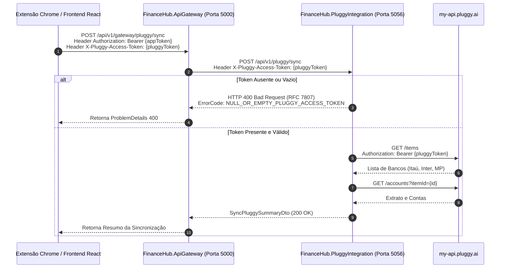

# 📋 Especificação Técnica: Fluxo Dinâmico de PluggyAccessToken via Frontend & BFF

**Feature**: Ingestão Dinâmica de Token do Meu.Pluggy via Requisição (Header / DTO)  
**Branch**: `feature/pluggy-token-header-flow`  
**Data**: 18/08/2026  
**Status**: Implementado e Validado (Testes Unitários + Testes Manuais API)  

---

## 🎯 1. Visão Geral e Histórico de Mudança

### 1.1 Problema Atual
Anteriormente, o microsserviço `FinanceHub.PluggyIntegration` dependia de uma variável de ambiente estática (`PLUGGY_USER_TOKEN` no `.env`) para realizar autenticação na API do `meu.pluggy.ai`. 

Essa abordagem possui severas limitações:
1. Impede a autenticação multi-usuário simultânea na plataforma.
2. Exige a reinicialização dos containers/microsserviços sempre que a sessão de um usuário no Pluggy expira.
3. Não reflete o fluxo real de produção, onde a aplicação gerencia seu próprio `accessToken` (JWT do FinanceHub) e o usuário fornece o `pluggyAccessToken` (capturado via Extensão do Chrome ou preenchimento na interface de Conexões).

### 1.2 Solução Proposta
Remover a dependência do token estático no `.env` do backend. 

**Escopo de Uso do Token**:
- **Exclusivo para a tela de Conexões** (`POST /api/v1/gateway/pluggy/sync` e consultas diretas ao conector Pluggy): O Frontend envia o `pluggyAccessToken` (via cabeçalho HTTP `X-Pluggy-Access-Token` ou DTO) **apenas quando o usuário solicita a listagem ou resincronização dos bancos no Pluggy**.
- **Demais rotas da aplicação (Dashboard, Extrato, Categorização, Projeções)**: Continuam utilizando **apenas o `accessToken` padrão da aplicação** (`Authorization: Bearer {appToken}`), pois os dados bancários já foram deduplicados e persistidos no banco PostgreSQL do `TransactionAggregator`.

---

## 🏛️ 2. Arquitetura do Fluxo de Dados e Sequência



---

## 🔐 3. Contratos de API e Headers

### 3.1 Cabeçalho Padrão
| Cabeçalho | Tipo | Obrigatório | Descrição |
| :--- | :--- | :--- | :--- |
| `Authorization` | String | Sim | `Bearer {financeHubAppJwtToken}` (Token da aplicação) |
| `X-Pluggy-Access-Token` | String | Sim | `token_sessao_exemplo...` (Token de sessão capturado do Meu.Pluggy) |

### 3.2 Constantes Centralizadas (Zero Magic Strings)
| Camada | Classe | Constante |
| :--- | :--- | :--- |
| **Shared** | `FinanceHub.Shared.Messaging.Constants.FinanceHubHeaderNames` | `PluggyAccessToken = "X-Pluggy-Access-Token"` |
| **PluggyIntegration Domain** | `PluggyConstants.HeaderNames` | `PluggyAccessToken` (cópia local, sem dep. Shared no Domain) |
| **Frontend** | `src/shared/api/apiEndpoints.ts` → `API_HEADERS` | `PLUGGY_ACCESS_TOKEN` |

### 3.3 Política de Retenção do Token no Frontend (`FinanceHub.Web`)
- O `pluggyAccessToken` capturado via extensão ou colar manual será retido no **`sessionStorage` do navegador**.
- O token permanece ativo para resincronizações automáticas enquanto a aba do FinanceHub permanecer aberta.
- Ao fechar a aba, o `sessionStorage` é limpo por segurança.

#### Backend CQRS Command (`FinanceHub.PluggyIntegration.Application`)
```csharp
// SyncAllPluggyAccountsCommand.cs
public record SyncAllPluggyAccountsCommand(
    string UserId,
    string PluggyAccessToken
);
```

#### DTO da Requisição Gateway (`FinanceHub.ApiGateway`)
```csharp
// GatewayPluggySyncRequestDto.cs
public record GatewayPluggySyncRequestDto(
    string? UserId,
    string? PluggyAccessToken
);
```

---

## 🚨 4. Mapeamento de Exceções de Domínio e RFC 7807

Toda exceção de validação lança uma classe fortemente tipada herdada de `DomainException`:

| Exceção de Domínio / Validação | Condição de Disparo | Status HTTP | ErrorCode | Local da Validação |
| :--- | :--- | :--- | :--- | :--- |
| `NullOrEmptyPluggyAccessTokenDomainException` | Token do Pluggy não informado no header `X-Pluggy-Access-Token` | 400 Bad Request | `NULL_OR_EMPTY_PLUGGY_ACCESS_TOKEN` | **ApiGateway e PluggyIntegration** (Validação antecipada) |
| `PluggySessionExpiredDomainException` | Token do Pluggy rejeitado pela API da Pluggy (403) | 401 Unauthorized | `PLUGGY_SESSION_EXPIRED` | **PluggyIntegration** |
| `PluggyApiCommunicationDomainException` | Falha de comunicação/timeout com a API Pluggy | 502 Bad Gateway | `PLUGGY_API_COMMUNICATION_ERROR` | **PluggyIntegration** |

### Exemplo de Resposta RFC 7807 (`ProblemDetails`):
```json
{
  "type": "https://tools.ietf.org/html/rfc7231#section-6.5.1",
  "title": "Erro de Negócio",
  "status": 400,
  "detail": "O token de acesso do Meu.Pluggy (pluggyAccessToken / X-Pluggy-Access-Token) é obrigatório para realizar a sincronização.",
  "instance": "/api/v1/gateway/pluggy/sync",
  "errorCode": "NULL_OR_EMPTY_PLUGGY_ACCESS_TOKEN",
  "traceId": "00-8f92a1b3c4d5e6f7a8b9c0d1e2f3a4b5-01"
}
```

---

## 🛠️ 5. Plano de Modificação por Arquivos

### 1. Camada Shared (`FinanceHub.Shared.Messaging`)
- **Criar**: `Constants/FinanceHubHeaderNames.cs` (constante centralizada `PluggyAccessToken`).

### 2. Camada de Domínio (`FinanceHub.PluggyIntegration.Domain`)
- **Criar**: `Domain/Exceptions/NullOrEmptyPluggyAccessTokenDomainException.cs`.
- **Atualizar**: `Domain/Constants/PluggyConstants.cs` (adicionar `HeaderNames.PluggyAccessToken`).

### 3. Camada de Aplicação (`FinanceHub.PluggyIntegration.Application`)
- **Atualizar**: `Interfaces/IMeuPluggyClient.cs` (métodos recebem `pluggyAccessToken` obrigatoriamente).
- **Atualizar**: `Commands/SyncAllPluggyAccounts/SyncAllPluggyAccountsCommand.cs` (inclui `PluggyAccessToken`).
- **Atualizar**: `Commands/SyncAllPluggyAccounts/SyncAllPluggyAccountsCommandHandler.cs` (valida o token e repassa para o client).

### 4. Camada de Infraestrutura (`FinanceHub.PluggyIntegration.Infrastructure`)
- **Atualizar**: `Clients/MeuPluggyClient.cs` (utiliza o `pluggyAccessToken` passado no parâmetro em vez de ler do `.env`).

### 5. Camada de API (`FinanceHub.PluggyIntegration.Api` e `FinanceHub.ApiGateway`)
- **Atualizar**: `PluggyEndpoints.cs` (extrai o header via `PluggyConstants.HeaderNames.PluggyAccessToken`).
- **Atualizar**: `IPluggyIntegrationServiceClient.cs` e `PluggyIntegrationServiceClient.cs` no Gateway (via `FinanceHubHeaderNames.PluggyAccessToken`).
- **Atualizar**: `PluggyGatewayEndpoints.cs` no Gateway.

### 6. Frontend (`FinanceHub.Web`)
- **Criar**: `src/shared/api/apiEndpoints.ts` (catálogo centralizado `API_ENDPOINTS` + `API_HEADERS`).
- **Atualizar**: `connectionsApi.ts` (usar `API_HEADERS.PLUGGY_ACCESS_TOKEN`).
- **Atualizar**: `httpClient.ts` (usar `API_HEADERS.CORRELATION_ID` e `API_ENDPOINTS.AUTH.*`).

### 7. Coleção do Postman (`FinanceHub.postman_collection.json`)
- Adicionar a variável `pluggyAccessToken`.
- Incluir o header `X-Pluggy-Access-Token: {{pluggyAccessToken}}` nas requisições de sync.
- Atualizar folder 4 para usar `{{pluggyAccessToken}}` (chamadas diretas ao Pluggy).

---

## 🧪 6. Estratégia de Testes (TDD Red -> Green -> Refactor)

1. **Red**: Escrever testes de unidade xUnit em `tests/FinanceHub.UnitTests` validando que disparar o Handler sem o token lança `NullOrEmptyPluggyAccessTokenDomainException`.
2. **Green**: Implementar o código mínimo para passar nos testes.
3. **Refactor**: Garantir desacoplamento e aderência às regras do projeto.

---

## 🔬 7. Resultados dos Testes Manuais contra API Real `meu.pluggy.ai` (18/08/2026)

### Dados Reais Validados

| Banco | ItemId | Status | Contas |
| :--- | :--- | :--- | :--- |
| **Itaú** | `9eacc475-3e3a-42ef-ab3c-f052d8c74ea2` | `UPDATED` / `SUCCESS` | CC (`CHECKING_ACCOUNT`) + Visa Signature (`CREDIT_CARD`) |
| **Inter** | `4fb086bc-6a60-4d01-85fe-1f4f871a9255` | `UPDATED` / `SUCCESS` | CC (`CHECKING_ACCOUNT`) + Gold (`CREDIT_CARD`) |
| **Mercado Pago** | `edd9e034-34c9-4a6f-83d2-b9ea0bf0e751` | `UPDATED` / `SUCCESS` | CC (`CHECKING_ACCOUNT`) + Cartão (`CREDIT_CARD`) |

### Resultado dos Cenários de Teste

| TC | Cenário | Endpoint | Resultado | Observação |
| :--- | :--- | :--- | :--- | :--- |
| TC-01 | Listar bancos conectados | `GET /items` | **PASSED** (200) | 3 bancos: Itaú, Inter, Mercado Pago |
| TC-03 | Contas Itaú | `GET /accounts?itemId=...` | **PASSED** (200) | CC + Visa Signature |
| TC-03b | Contas Mercado Pago | `GET /accounts?itemId=...` | **PASSED** (200) | CC + Cartão MP |
| TC-03c | Contas Inter | `GET /accounts?itemId=...` | **PASSED** (200) | CC + Gold |
| TC-04 | Transações Itaú | `GET /transactions?accountId=...` | **PASSED** (200) | 61 transações reais |
| TC-05 | Token ausente | `GET /items` (sem header) | **PASSED** (403) | `Missing or invalid authorization token` |
| TC-06 | Token inválido | `GET /items` (token lixo) | **PASSED** (403) | `Missing or invalid authorization token` |

### Descoberta Importante
A API `meu.pluggy.ai` retorna **HTTP 403** (não 401) para tokens ausentes ou inválidos. A exceção `PluggySessionExpiredDomainException` deve mapear tanto `401` quanto `403` como `PLUGGY_SESSION_EXPIRED`.

